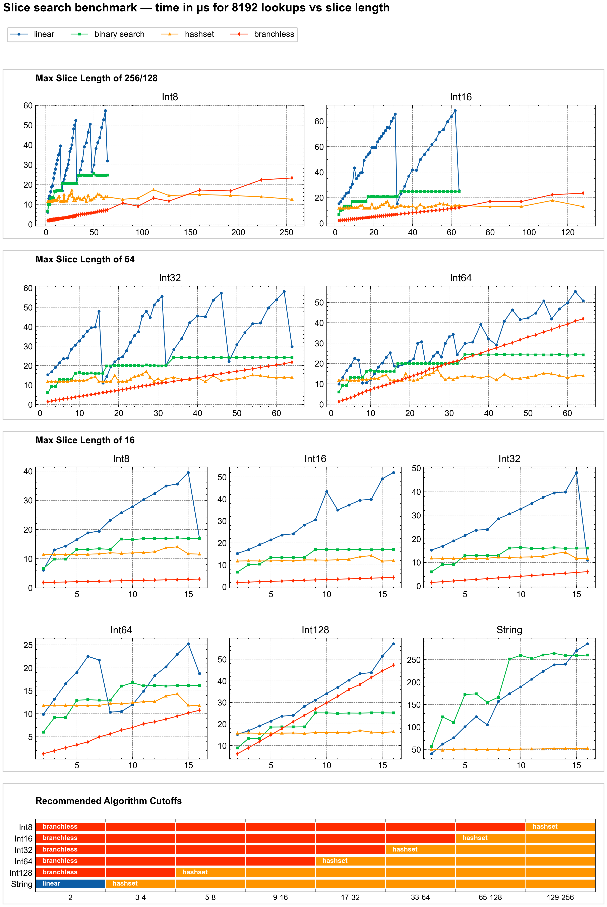

# Slice Search Benchmark Analysis

This document analyzes the performance of four search strategies for membership testing in sorted slices, typical of SQL `IN (list)` processing.

## Benchmark Results

Results are stored per-CPU in subfolders. See:
- [`Apple_M1_Max/slice_search.png`](Apple_M1_Max/slice_search.png) — Visual comparison
- [`Apple_M1_Max/CUTOFFS.md`](Apple_M1_Max/CUTOFFS.md) — Recommended algorithm cutoffs



## Benchmark Configuration

| Parameter | Value |
|-----------|-------|
| **Batch size** | 8,192 lookups per measurement |
| **Metric** | Minimum time (noise only adds, never subtracts) |
| **Hit rate** | ~50% (mix of hits and misses) |
| **String length** | 32 characters (differentiating suffix) |
| **Platform** | Apple M1 Max (QoS set to prefer P-cores) |

### Data Types Tested

| Type | Sizes Benchmarked | Bytes |
|------|-------------------|-------|
| `i8` | 2–256 | 1 |
| `i16` | 2–128 | 2 |
| `i32` | 2–64 | 4 |
| `i64` | 2–64 | 8 |
| `i128` | 2–16 | 16 |
| `str` | 2–16 | 32 (chars) |

### Search Methods

1. **linear** (`slice.contains()`) — O(n) scan
2. **binary search** (`slice.binary_search()`) — O(log n)
3. **hashset** (`HashSet::contains()`) — O(1) amortized
4. **branchless** — Const-generic SIMD-friendly linear scan (numeric only)

## Key Findings

### 1. Branchless Dominates for Small Numeric Slices

The const-generic branchless implementation wins decisively for small numeric types:

| Type | Branchless Wins Up To |
|------|----------------------|
| i8 | 128 elements |
| i16 | 64 elements |
| i32 | 32 elements |
| i64 | 16 elements |
| i128 | 4 elements |

**Why?** The compiler knows the exact array size at compile time, enabling:
- Full loop unrolling
- SIMD auto-vectorization (NEON on Apple Silicon)
- No branch misprediction (uses bitwise OR accumulation)

### 2. HashSet Wins for Larger Slices

Once slice size exceeds the branchless threshold, HashSet's O(1) lookup dominates:
- Near-constant time regardless of slice size
- Construction cost amortized over 8,192 lookups per batch

### 3. Binary Search is Never Optimal

**Surprising finding**: Binary search is never the best choice in batch scenarios.
- For small sizes: branchless beats it via SIMD
- For large sizes: HashSet beats it with O(1) vs O(log n)

Binary search only makes sense for single lookups where HashSet construction isn't amortized.

### 4. Strings Behave Differently

Without branchless (requires `Copy` trait), strings show:
- **Linear scan wins for ≤2 elements** (no comparison overhead)
- **HashSet wins for ≥3 elements** (hashing amortizes string comparison cost)

## Recommended Algorithm Selection

```rust
match (element_type, slice_length) {
    // Small numeric types: branchless has longest runway
    (i8, ..=128)  => branchless,
    (i16, ..=64)  => branchless,
    (i32, ..=32)  => branchless,
    (i64, ..=16)  => branchless,
    (i128, ..=4)  => branchless,
    
    // Strings: very short cutoff
    (str, ..=2)   => linear,
    
    // Everything else: HashSet
    _             => hashset,
}
```

### Simplified Decision Tree

```python
def select_algorithm(element_type, slice_length):
    if element_type.is_numeric() and slice_length <= branchless_cutoff(element_type):
        return "branchless"
    elif element_type == "str" and slice_length <= 2:
        return "linear"
    else:
        return "hashset"
```

## Why These Cutoffs?

### SIMD Register Capacity

The branchless cutoff correlates inversely with type size:

| Type | Bytes | NEON Elements/Register | Optimal Branchless Cutoff |
|------|-------|------------------------|---------------------------|
| i8 | 1 | 16 | 128 |
| i16 | 2 | 8 | 64 |
| i32 | 4 | 4 | 32 |
| i64 | 8 | 2 | 16 |
| i128 | 16 | 1 | 4 |

Smaller types pack more elements per SIMD register, extending the branchless advantage.

### Empirical Formula

The M1 Max data reveals a consistent relationship:

```
cutoff = 8 × (register_bits / type_bits)
       = 8 × elements_per_register
```

For example, with NEON's 128-bit registers and `i32` (32 bits):
- Elements per register = 128 / 32 = 4
- Predicted cutoff = 8 × 4 = 32 ✓

The multiplier of 8 represents approximately how many SIMD operations can execute before HashSet's O(1) lookup (with its hashing and memory indirection overhead) becomes faster.

### Predicted Cutoffs by Platform

Applying the formula to different SIMD widths:

| Platform | Register Bits | i8 | i16 | i32 | i64 |
|----------|---------------|-----|-----|-----|-----|
| SSE / NEON | 128 | 128 | 64 | 32 | 16 |
| AVX2 | 256 | 256 | 128 | 64 | 32 |
| AVX-512 | 512 | 512 | 256 | 128 | 64 |

**Note:** Intel/AMD CPUs with AVX2 or AVX-512 have not yet been benchmarked. Running this benchmark suite on x86 hardware would validate the empirical formula and confirm whether the 8× multiplier holds across architectures. To benchmark with wider SIMD enabled:

```bash
RUSTFLAGS="-C target-cpu=native" cargo bench
python3 results/plot_results.py  # saves to results/<CPU_NAME>/
```

### HashSet Overhead

HashSet has fixed overhead:
- Hash computation per lookup
- Memory indirection
- Cache behavior

This overhead is amortized at larger sizes but dominates at small sizes.

## Implementation Notes

### Branchless Check

```rust
fn branchless_check<T: Copy + PartialEq, const N: usize>(
    haystack: &[T; N], 
    needle: T
) -> bool {
    haystack.iter().fold(false, |acc, &v| acc | (v == needle))
}
```

The `const N` parameter enables the compiler to fully unroll and vectorize.

### Batch Processing

All benchmarks process 8,192 lookups per iteration, matching typical Arrow array batch sizes. This amortizes:
- HashSet construction
- Function call overhead
- Match dispatch for branchless size selection

## Reproducing Results

```bash
cd benchmarks/slice-search

# Clear previous results
rm -rf ../../target/criterion

# Run benchmarks (results saved to target/criterion/)
cargo bench

# Generate plots and cutoff recommendations
python3 results/plot_results.py
```

Results are automatically saved to a CPU-specific subfolder (e.g., `results/Apple_M1_Max/`).

## Conclusion

For DataFusion's IN LIST processing:

1. **Use branchless** for small numeric IN lists (size varies by type)
2. **Use HashSet** for larger lists and strings (≥3 elements)
3. **Never use binary search** in batch scenarios

The branchless approach provides **2–10× speedup** over alternatives for small numeric slices, making it the clear winner for the common case of IN lists with few elements.
